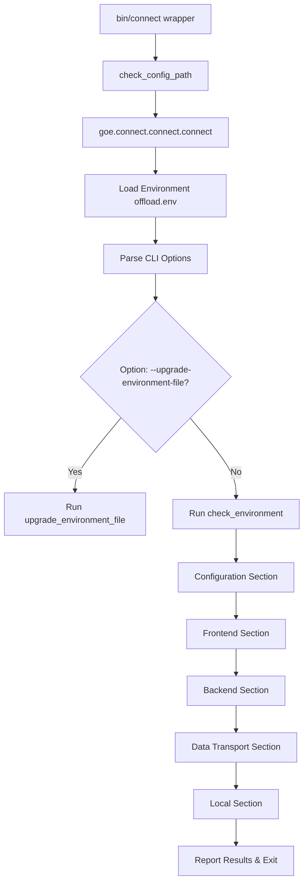

# Retrospective Design Document: Connect Environment Verification Tool

## 1. Executive Summary & Scope

The `connect` tool (`bin/connect`) is a post-installation user verification tool designed to validate that the Gluent Offload Engine (GOE) environment is correctly configured and healthy before running offload operations. It executes a suite of tests spanning configuration, database connectivity, and platform access, providing immediate visual feedback and structured exit codes.

### Supported Topologies
* **Frontend**: Oracle Database.
* **Backend**: Google Cloud Platform (BigQuery).

### Out of Scope Topologies
While the underlying codebase contains legacy verification routines for other systems, the following targets are officially **out of scope** and disabled for this environment deployment:
* **Backend**: Hadoop distributions (Cloudera, etc.), Snowflake, and Azure Synapse.
* **Data Transport**: Apache Livy and Spark Thrift Server.

---

## 2. Architecture & High-Level Execution Flow

`connect` is implemented in Python and triggered via a wrapper shell script.

### Execution Phases
1. **Initialization**: Checks for the existence of the `OFFLOAD_HOME` environment variable, loads the `offload.env` environment file, and parses CLI flags.
2. **Configuration Validation**: Assesses the integrity and permissions of configuration files.
3. **Frontend Verification**: Validates database connectivity, driver modes, and schema compatibility on the source database.
4. **Backend Verification**: Validates access permissions, service APIs, and encryption assets on the target cloud platform.
5. **Data Transport Verification**: Runs loopback tests to ensure the transport engine (Spark) can initiate bidirectional connectivity.
6. **Local Verification**: Evaluates host operating system details and local helper scripts.

---

## 3. Detailed Verification Specifications

### 3.1. Configuration Checks
* **Template Delta Check**: Compares keys defined in the active `$OFFLOAD_HOME/conf/offload.env` against the relevant template (e.g., `oracle-bigquery-offload.env.template`).
  * If keys exist in `offload.env` but not in the template (potentially deprecated configuration), a **Warning** is generated.
  * If keys exist in the template but are missing in `offload.env`, a **Warning** is generated, prompting the user to upgrade.
* **File Permissions Check**: Inspects `$OFFLOAD_HOME/conf/offload.env`. Expects permissions to be exactly `640` (owner read/write, group read, others no access). Deviations result in a **Warning**.

### 3.2. Frontend Checks (Oracle)
* **Connectivity Checks**:
  * Attempts to connect as the application user (`rdbms_app_user`) and the administrative user (`ora_adm_user`).
  * Supports connection via standard credentials or secure Oracle Wallet configurations.
* **Driver Mode Check**: Validates the Python `oracledb` driver operational mode (Thin mode vs. Thick mode based on configuration).
* **Database Version Check**: Asserts that the Oracle Database version is at or above the minimum supported version (`10.2.0.1`).
* **Component Version Matching**: Compares the version of the installed database components (compiled schema packages) against the client binary version to ensure they are synchronized.
* **Metadata & Parameters (Informational)**:
  * Queries session attributes (`DB_UNIQUE_NAME`, `SESSION_USER`) and character sets (`NLS_CHARACTERSET`, `NLS_NCHAR_CHARACTERSET`).
  * Queries database parameters: `processes`, `sessions`, `query_rewrite_enabled`, and `_optimizer_cartesian_enabled`.
  * > [!NOTE]
  * > The database parameters are collected for diagnostic and informational purposes only. No threshold assertions are applied. This section is slated for removal in a future release per **GitHub Issue #265**.

### 3.3. Backend Checks (BigQuery)
* **API Access & Connection**: Instantiates the BigQuery backend API client and queries the backend user identity to confirm that the BigQuery API is enabled and accessible.
* **KMS Key Verification**: If a Cloud KMS key is configured for data encryption, `connect` queries the key status and metadata:
  * Verifies the key state is `ENABLED`.
  * Verifies the key purpose is `ENCRYPT_DECRYPT`.

### 3.4. Data Transport Checks (Spark)
Data transport validation tests that the data processing cluster can fetch data from the source Oracle database.
* **GCP Dataproc / Dataproc Batches**:
  * Validates availability of the `gcloud` command-line executable.
  * Checks integration with Google Dataproc (clusters) or Google Dataproc Batches (serverless Spark).
* **Generic Spark Submit**: Validates the availability of `spark-submit` executable if configured.
* **RDBMS Connection Callback (Loopback Ping)**:
  * For the active transport method, `connect` triggers a remote Spark task that attempts to establish a JDBC connection back to the source Oracle Database (`ping_source_rdbms()`).
  * If the remote job cannot connect back (e.g., due to firewall blockages between the Dataproc network and the Oracle database host), the test reports a **Failure**.

### 3.5. Local Checks
* **OS Distribution & Kernel Check**: Reads `/etc/redhat-release`, `/etc/SuSE-release`, or `/etc/os-release` and executes `uname -r`. Fails if the operating system distribution is unrecognized.
* **GEL Listener & Redis Cache (Disabled)**:
  * > [!IMPORTANT]
  * > The Gluent Event Listener (GEL) and Redis cache status checks are currently hard-disabled in the codebase pending **GitHub Issue #109**.

---

## 4. Diagnostics & Exit Strategy

`connect` communicates test outcomes using console log severity colors (Passed in green, Warning in yellow, Failed in red) and reports execution health to callers via standard OS exit codes:

| Exit Code | Severity | Description |
| :--- | :--- | :--- |
| **`0`** | Success | All executed checks completed successfully. |
| **`1`** | Fatal | A critical/uncaught exception occurred (e.g., completely unable to connect to Oracle RDBMS during startup). |
| **`2`** | Failure | One or more active validation checks failed (e.g., Dataproc callback failed, KMS key disabled). |
| **`3`** | Warning | No failures occurred, but one or more warnings were detected (e.g., incorrect `offload.env` permissions). |

---

## 5. Operational Utilities

### Configuration Upgrade (`--upgrade-environment-file`)
To simplify transitions between Gluent software releases, `connect` provides an automated upgrade routine:
* When executed with `--upgrade-environment-file`, it compares the user's active `offload.env` against the reference template.
* It appends any newly introduced configuration parameters (along with default values and template documentation comments) to the end of the user's `offload.env`.
