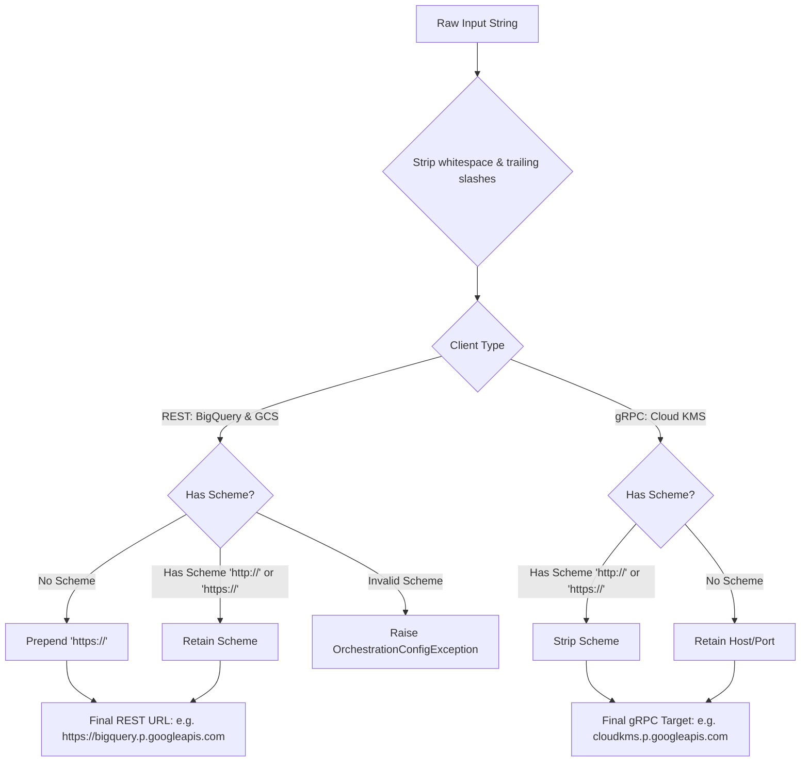
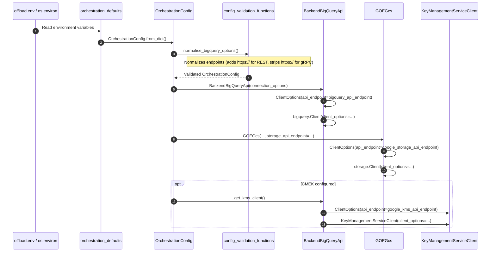

# Design Document: Custom Google APIs Endpoints for BigQuery, Cloud Storage, and Cloud KMS

## 1. Executive Summary & Motivation

### 1.1. Context & Problem Statement
In enterprise customer deployments with strict network boundaries (such as Private Service Connect (PSC), Private Google Access, or restricted outbound corporate proxies/firewalls), egress to default public Google API domains (`*.googleapis.com`) is blocked.

Customers must route traffic to private endpoints, for example:
* Private Service Connect endpoints (e.g. `bigquery.p.googleapis.com`, `storage.p.googleapis.com`, `cloudkms.p.googleapis.com`).
* Customer internal DNS names or reverse proxies (e.g. `https://bigquery-psc.internal.company.com`).

While Google Cloud client libraries for Python support custom endpoints via `google.api_core.client_options.ClientOptions(api_endpoint=...)`, the Gluent Offload Engine (GOE) does not currently provide configuration settings to pass custom endpoints to the Google Cloud clients. As a result, connection attempts fail in these environments.

This work addresses [GitHub Issue #239](https://github.com/gluent/goe/issues/239) and covers all three Google Cloud services invoked directly by GOE when targeting Google BigQuery:
1. **Google BigQuery** (orchestration query engine and metadata repository)
2. **Google Cloud Storage (GCS)** (data staging and log storage)
3. **Google Cloud Key Management Service (Cloud KMS)** (customer-managed encryption keys / CMEK)

### 1.2. Key Objectives
* Provide configuration variables in `offload.env` for BigQuery, Cloud Storage, and Cloud KMS endpoints.
* Allow users to supply endpoints with or without scheme (e.g. `bigquery.p.googleapis.com` or `https://bigquery.p.googleapis.com`).
* Automatically normalize endpoints according to the underlying client protocol requirements (HTTP/REST vs gRPC).
* Ensure full backward compatibility: if not specified, clients default to standard Google public endpoints.
* Integrate with GOE configuration validation and the `connect` verification utility.

---

## 2. Configuration Specifications

### 2.1. Environment Variables in `offload.env.template.bigquery`

Three new optional configuration variables will be introduced in `templates/conf/offload.env.template.bigquery`:

| Environment Variable | Config Attribute | Target Client | Default | Description & Examples |
| :--- | :--- | :--- | :--- | :--- |
| `BIGQUERY_API_ENDPOINT` | `bigquery_api_endpoint` | `bigquery.Client` | `None` (public endpoint) | Custom API endpoint for Google BigQuery.<br/>Examples: `bigquery.p.googleapis.com`, `https://bigquery.p.googleapis.com`, `https://my-bq-proxy.internal.corp:8443` |
| `GOOGLE_STORAGE_API_ENDPOINT` | `google_storage_api_endpoint` | `storage.Client` & `fsspec` | `None` (public endpoint) | Custom API endpoint for Google Cloud Storage.<br/>Examples: `storage.p.googleapis.com`, `https://storage.p.googleapis.com`, `https://my-gcs-proxy.internal.corp:8443` |
| `GOOGLE_KMS_API_ENDPOINT` | `google_kms_api_endpoint` | `kms.KeyManagementServiceClient` | `None` (public endpoint) | Custom API endpoint for Google Cloud KMS (CMEK).<br/>Examples: `cloudkms.p.googleapis.com`, `cloudkms.p.googleapis.com:443`, `https://cloudkms.p.googleapis.com` |

### 2.2. Placement in Template
In `templates/conf/offload.env.template.bigquery`:
* `BIGQUERY_API_ENDPOINT` placed in the **Google BigQuery settings** section directly following `BIGQUERY_DATASET_PROJECT`.
* `GOOGLE_STORAGE_API_ENDPOINT` placed in the **Filesystem type for Offloaded tables** section following `OFFLOAD_FS_CONTAINER`.
* `GOOGLE_KMS_API_ENDPOINT` placed in the **Google Cloud Key Management Service** section following `GOOGLE_KMS_KEY_NAME`.

---

## 3. Endpoint Normalization & Validation Rules

### 3.1. User Experience Requirement
Users should not need to remember whether a particular Google client uses HTTP REST (requiring `https://`) or gRPC (requiring `host:port`). GOE will accept hostnames in either format and normalize them.

### 3.2. Normalization Rules



#### REST Clients (`BIGQUERY_API_ENDPOINT`, `GOOGLE_STORAGE_API_ENDPOINT`)
* Underlying clients: `google.cloud.bigquery.Client` and `google.cloud.storage.Client` use `requests` over HTTP/HTTPS.
* If no scheme is present (e.g. `bigquery.p.googleapis.com`), normalize by prepending `https://` -> `https://bigquery.p.googleapis.com`.
* If explicit `http://` or `https://` is supplied, preserve it.
* Strip any trailing slash (`/`).
* If a scheme other than `http` or `https` is given, raise `OrchestrationConfigException`.

#### gRPC Clients (`GOOGLE_KMS_API_ENDPOINT`)
* Underlying client: `google.cloud.kms.KeyManagementServiceClient` uses gRPC (`grpc.secure_channel`).
* gRPC target addresses must be formatted as `host` or `host:port` without URL schemes.
* If a scheme (`https://` or `http://`) is supplied (e.g. `https://cloudkms.p.googleapis.com`), strip the scheme -> `cloudkms.p.googleapis.com`.
* Strip any trailing slash (`/`).
* If no port is specified, the Google GAPIC transport automatically defaults to `:443`. If a port is explicitly included (e.g. `cloudkms.p.googleapis.com:8443`), retain it.

---

## 4. Architecture & Component Flow



---

## 5. Detailed File Changes

### 5.1. Configuration Template
* **File**: `templates/conf/offload.env.template.bigquery`
  * Add `# BIGQUERY_API_ENDPOINT=` with explanatory comments.
  * Add `# GOOGLE_STORAGE_API_ENDPOINT=` with explanatory comments.
  * Add `# GOOGLE_KMS_API_ENDPOINT=` with explanatory comments.
* **Build Artifact**:
  * Running `make install` in `templates/conf/` regenerates:
    * `target/offload/conf/oracle-bigquery-offload.env.template`
    * `target/offload/conf/teradata-bigquery-offload.env.template`

### 5.2. Defaults Management
* **File**: `src/goe/config/orchestration_defaults.py`
  * Add default resolver functions:
    ```python
    def bigquery_api_endpoint_default() -> Optional[str]:
        return os.environ.get("BIGQUERY_API_ENDPOINT")

    def google_storage_api_endpoint_default() -> Optional[str]:
        return os.environ.get("GOOGLE_STORAGE_API_ENDPOINT")

    def google_kms_api_endpoint_default() -> Optional[str]:
        return os.environ.get("GOOGLE_KMS_API_ENDPOINT")
    ```

### 5.3. Orchestration Config Dataclass
* **File**: `src/goe/config/orchestration_config.py`
  * Add to `EXPECTED_CONFIG_ARGS`:
    * `"bigquery_api_endpoint"`
    * `"google_storage_api_endpoint"`
    * `"google_kms_api_endpoint"`
  * Add dataclass attributes:
    ```python
    bigquery_api_endpoint: Optional[str]
    google_storage_api_endpoint: Optional[str]
    google_kms_api_endpoint: Optional[str]
    ```
  * In `OrchestrationConfig.from_dict()`:
    Map each new field from `config_dict` using the corresponding `orchestration_defaults` function.

### 5.4. Validation & Normalization
* **File**: `src/goe/config/config_validation_functions.py`
  * Add helper functions:
    ```python
    def normalise_rest_api_endpoint(endpoint: Optional[str], exc_cls=OrchestrationConfigException) -> Optional[str]:
        """Normalize HTTP/REST endpoint: ensure https:// or http:// and strip trailing slash."""
        ...

    def normalise_grpc_api_endpoint(endpoint: Optional[str], exc_cls=OrchestrationConfigException) -> Optional[str]:
        """Normalize gRPC endpoint: strip scheme and trailing slash."""
        ...
    ```
  * In `normalise_bigquery_options(options, exc_cls)`:
    * Apply `normalise_rest_api_endpoint` to `options.bigquery_api_endpoint` and `options.google_storage_api_endpoint`.
    * Apply `normalise_grpc_api_endpoint` to `options.google_kms_api_endpoint`.

### 5.5. BigQuery & KMS Client Setup
* **File**: `src/goe/offload/bigquery/bigquery_backend_api.py`
  * In `BackendBigQueryApi.__init__`:
    * Store `self._bigquery_api_endpoint = connection_options.bigquery_api_endpoint or None`
    * Store `self._google_kms_api_endpoint = connection_options.google_kms_api_endpoint or None`
  * In `BackendBigQueryApi._get_bq_client()`:
    * Construct `ClientOptions(api_endpoint=self._bigquery_api_endpoint)` when endpoint is provided.
    * Pass `client_options=client_options` to `bigquery.Client(...)`.
  * In `BackendBigQueryApi._get_kms_client()`:
    * Construct `ClientOptions(api_endpoint=self._google_kms_api_endpoint)` when endpoint is provided.
    * Pass `client_options=client_options` to `kms.KeyManagementServiceClient(...)`.

### 5.6. GCS Staging & Logging Clients
* **File**: `src/goe/filesystem/goe_gcs.py`
  * In `GOEGcs.__init__`:
    * Accept `storage_api_endpoint: Optional[str] = None`.
    * When constructing `self._client = storage.Client(...)`, pass `client_options=ClientOptions(api_endpoint=self._storage_api_endpoint)` if set.
* **File**: `src/goe/filesystem/goe_dfs_factory.py`
  * When instantiating `GOEGcs`, pass `storage_api_endpoint=config.google_storage_api_endpoint`.
* **File**: `src/goe/util/goe_log_fh.py`
  * In `_get_fs()`:
    * If `GOOGLE_STORAGE_API_ENDPOINT` is defined in environment, pass `endpoint_url=storage_api_endpoint` to `fsspec.filesystem("gs", ...)`.

### 5.7. Environment Verification Tool (`connect`)
* **File**: `src/goe/connect/connect.py`
  * In `run_backend_tests()`:
    * When `orchestration_config.bigquery_api_endpoint` is set, log details:
      `detail("Using custom BigQuery API endpoint: %s" % orchestration_config.bigquery_api_endpoint)`
    * If `google_storage_api_endpoint` or `google_kms_api_endpoint` is set, log corresponding messages.

---

## 6. Testing Strategy

### 6.1. Unit Tests
1. **Config & Defaults Tests** (`tests/unit/config/test_orchestration_config.py`):
   * Verify all 3 new attributes are in `EXPECTED_CONFIG_ARGS` and reflected on `OrchestrationConfig`.
   * Test `OrchestrationConfig.from_dict()` with mock values.
2. **Normalization & Validation Tests** (`tests/unit/config/test_config_validation_functions.py`):
   * Parameterized tests for REST endpoints:
     * Host without scheme: `bigquery.p.googleapis.com` -> `https://bigquery.p.googleapis.com`
     * Host with trailing slash: `bigquery.p.googleapis.com/` -> `https://bigquery.p.googleapis.com`
     * Host with explicit `https://`: `https://bigquery.p.googleapis.com` -> `https://bigquery.p.googleapis.com`
     * Host with explicit `http://`: `http://localhost:9050` -> `http://localhost:9050`
     * Host with port: `bigquery.p.googleapis.com:8443` -> `https://bigquery.p.googleapis.com:8443`
     * Invalid URL schemes or malformed strings raise `OrchestrationConfigException`.
   * Parameterized tests for gRPC endpoints:
     * Host with `https://`: `https://cloudkms.p.googleapis.com` -> `cloudkms.p.googleapis.com`
     * Host with `http://`: `http://cloudkms.p.googleapis.com:8443` -> `cloudkms.p.googleapis.com:8443`
     * Host without scheme: `cloudkms.p.googleapis.com` -> `cloudkms.p.googleapis.com`
3. **Backend API Client Tests** (`tests/unit/offload/test_backend_api.py`):
   * Mock `bigquery.Client` and verify `client_options.api_endpoint` receives the configured BigQuery endpoint.
   * Mock `kms.KeyManagementServiceClient` and verify `client_options.api_endpoint` receives the configured KMS endpoint.
4. **GCS Filesystem Tests**:
   * Verify `GOEGcs` passes `client_options` with custom endpoint to `storage.Client`.
5. **Mock Environment Updates** (`tests/unit/test_functions.py`):
   * Update `FAKE_ORACLE_BQ_ENV` to include sample values for the new variables.

### 6.2. Regression & Verification
* Run the complete unit test suite: `pytest tests/unit/`.
* Test `connect --upgrade-environment-file` against a sample `offload.env` to verify template comparison and automated upgrade behavior.
